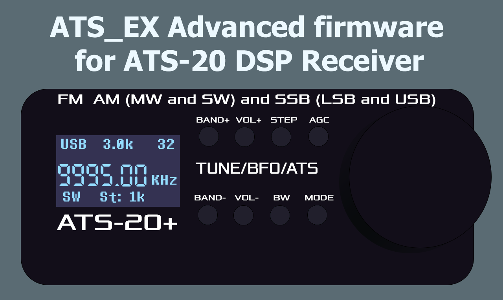
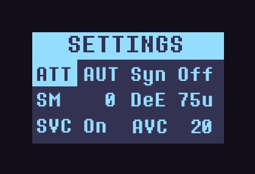
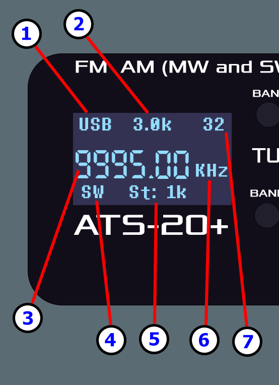

# Прошивка ATS_EX для приёмника ATS-20
## Общее описание
Это расширенная прошивка для приёмников **ATS-20**, которые работают на **Arduino Nano** и чипе DSP приёмника **Si473x**. 
Прошивка ATS_EX создана мной, **Goshante**, основана на наработках прошивки **PU2CLR** и вдохновлена прошивкой от **swling.ru** с закрытым исходным кодом.

**Последняя версия:** v1.05 (04.03.2024)

**Ссылка на скачивание готового .hex файла прошивки:** [>>> Нажмите здесь <<<](https://github.com/goshante/ats20_ats_ex/releases/download/v1.05/ATS_EX_v1.05.hex)

    

# Особенности

 - Полностью **переработан интерфейс**. Больше никаких растянутых шрифтов. Минималистичный и читабельный интерфейс. Семисегмантный шрифт частоты был воссоздан мной таким, каким он был в прошивке от swling.
 - Полностью **переработаны элементы управления**. Краткое руководство пользователя находится здесь, ниже.
 - **BFO теперь часть общей частоты приёмника, пока активен SSB** и регулируется общим шагом частоты, больше никаких выделенных отдельных настроек BFO, которые только путают и делают ход по частоте неудобным и ужасным. В режиме SSB доступны более точные шаги.
 - **LW** Диапазон: От **149** to **520** KГц
 - **MW** Диапазон: От **520** to **1710** KГц
 - **SW** Диапазон: От **1700** to **30000** КГц (С большим количеством поддиапазонов)
 - **FM** Диапазон: От **64** to **108** МГц. (Два поддиапазона от **64** и от **84** МГц)
 - Добавлена **CW модуляция**
 - Все **КВ (SW) диапазоны** теперь ощущаются как один большой диапазон **от 1700 до 30000 КГц**. Всё еще можно переключаться между SW диапазонами, но они больше не ограничивают шаг частоты пределами поддиапазона.
 - **Настройка частот стала максимально плавной** в режиме SSB благодаря объединению частоты приема с BFO. Грубое переключение частот теперь происходит каждые 16 КГц (**бесшовная настройка в обоих направлениях покрывает полные 32 Гц, намного меньше "пшиков".**). В не-SSB режимах теперь вы также можете настраивать частоту быстрее, **энкодер должен реагировать более отзывчиво**.
 - **Доступно множество шагов для каждого режима**. В AM у вас есть шаги 1/5/9/10/50/100k/1M, в SSB есть шаги 1/5/9/10k и шаги 10/25/50/100/500Гц для более точной настройки. В режиме FM у вас есть шаги 10k/100k/1M.
 - Добавлена страница настроек. Вы можете настроить **Управление усилением и ATT**, **Мягкое выключение звука**, **Автоматическое управление громкостью** (AVC), Включить или Выключить **AVC для режима SSB**, **Деэмфазис** для режима FM и включить или выключить **режим синхронизации SSB**, и прочие другие полезные настройки.
 - Регулируемая **яркость экрана**.
 - Регулируемая **частота процессора**, возможность снизить её на 50% для большего энергосбережения батареи.
 - Добавлена **кнопка выключения звука** и **кнопка включения/выключения дисплея**.
 - Добавлено **отображение состояния заряда батареи** (Требуется небольшой мод: Сделать **делитель напряжения** из двух резисторов по 10 КОм и припаять его среднюю точку к пину **A2**)
 - Добавлен **S-метр**
 - **Контроллер Atm328p теперь работает на полной частоте**. Управление должно быть более отзывчивым. (Не знаю, как это влияет на расход батареи.)
 - Рефакторинг кода, оптимизации
 - Исправлены некоторые баги
 # Как прошить мой приёмник?
 Вы можете использовать любой софт, способный прошивать .hex файл прошивки на Arduino. Вам понадобится только Micro USB кабель и **драйвер USB UART** (вероятнее всего, это будет драйвер для контроллера **CH341**). Я рекомендую использовать программу **AVRDUDESS**, если вы используете Windows. Это простой инструмент с графическим интерфейсом, который может дампить и прошивать файлы прошивок на микроконтроллеры Atmel(Ардуино). Просто выберите **"Arduino Nano (ATmega328P)"** из раздела **Presets**, выберите ваш фактический **COM порт** и **путь к файлу прошивки** .hex. Выберите режим **"Write"** в разделе **Flash** и нажмите **Go**.

Или можно собрать прошивку самостоятельно. Я использую Visual Studio 2022 с расширением VSMicro, которое использует Arduino IDE 1.8. Вы можете просто использовать Arduino IDE, собрать скетч самостоятельно и загрузить его в контроллер прямо из IDE.

# Руководство пользователя
**ВНИМАНИЕ:** После прошивки настоятельно **рекомендуется сбросить память EEPROM**. Для этого просто удерживайте **Кнопку Энкодера** при включении приемника.
### Кнопки

 1. **BAND+** : Короткое нажатие для входа в режим **выбора диапазона**. Выберите диапазон с помощью **Вращения Энкодера** и подтвердите с помощью **Кнопки Энкодера** или повторным нажатием кнопки **BAND+**. В **режиме настроек** данная кнопка переключает **страницы настроек**. Зажмите для быстрой прокрутки диапазонов вперёд.
 2. **VOL+** : Короткое нажатие для входа в режим **регулировки громкости**. Установите громкость с помощью **Вращения Энкодера** и подтвердите с помощью **Кнопки Энкодера** или повторным нажатием кнопки **VOL+**. Долгое нажатие быстро увеличивает громкость.
 3. **STEP** : Короткое нажатие для входа в режим **регулировки шага**. Установите шаг с помощью **Вращения Энкодера** и подтвердите с помощью **Кнопки Энкодера** или повторным нажатием кнопки **STEP**.
 4. **AGC** : Короткое нажатие для **включения и выключения дисплея**. Долгое нажатие для переключения режима **Sync** при активной **SSB** модуляции.
 5. **BAND-** : Короткое нажатие для открытия/закрытия **экрана настроек**.  Зажмите для быстрой прокрутки диапазонов назад.
 6. **VOL-** : Короткое нажатие для **включения и выключения беззвучного режима**. Долгое нажатие быстро меньшает громкость.
 7. **BW** : Короткое нажатие для входа в режим **регулировки ширины полосы пропускания**. Установите шаг с помощью **Вращения Энкодера** и подтвердите с помощью **Кнопки Энкодера** или повторным нажатием кнопки **BW**. Зажмите, чтобы показать/скрыть шкалу S-метра, отображающую уровень сигнала.
 8. **MODE** : Короткое нажатие для **переключения между модуляциями**. На диапазоне **FM** единственная доступная модуляция - **WFM** (FM с широкой полосой), и кнопка **MODE** отключена. На всех остальных диапазонах доступны следующие модуляции: **AM/USB/LSB/CW**. Во всех модуляциях(Особенно в SSB) улучшенная настройка частоты без прерывания на каждом шаге.
 9. **Вращение Энкодера** : Настройка **Частоты** или **навигация по настройкам**.
 10. **Кнопка Энкодера** : В **не-SSB** режиме - Короткое нажатие для **поиска станций** или **подтверждения выбора настройки**. Также сбрасывает память **EEPROM** при удержании этой кнопки при запуске. В SSB режиме делает то же самое, что и короткое нажатие кнопки **STEP**.
### Настройки
Навигация в настройках с помощью **Вращения Энкодера**, подтверждение выбора с помощью **Кнопки Энкодера**, изменение значения с помощью **Вращения Энкодера** и сохранение его с помощью снова той же **Кнопки Энкодера**. Закрыть настройки можно кнопкой **BAND-**. Переключаться между **страницами настроек** можно при помощи кнопки **BAND+**.

    

**ATT** : Значение **аттенюации**. **AUT** означает **Автоматическое управление усилением**. Этот параметр может быть либо **AUT**, либо числом от **1** до **37**.

**SM** : **Soft Mute** (Софт мьют). Это число от **0** до **32**.

**AVC** : **Automatic Volue Control** (Автоматическая регулировка громкости). Это число от **12** до **90**.

**SVC** : Включает либо отключает **AVC режим для SSB**.

**DeE** : Только для режима **FM**. Это значение **DeEmphasis** в микросекундах. Может быть либо **50**, либо **75**.

**Syn** : Включить либо выключить **режим Sync для SSB**.

**Scr** : Регуляция яркости дисплея. Это число от **5** до **125**.

**SW** : **Единицы частоты** для AM модуляции в SW(КВ) диапазоне. Может быть либо **KHz**, либо **MHz**. В режиме MHz мегагерцы отделяются от частоты точкой.

**SSM** : **SSB Soft Mute Mode**. Режим работы Soft Mute для SSB. Может быть либо  **RSS** (SM зависит от значения RSSI) или **SNR** (SM зависит от соотношения сигнал/шум).

**COF**: Фильтр отсечения боковых полос (**SSB Cutoff Filter**). Имеет 3 режима: **On** - полосовой фильтр для подавления обеих нежелательных частей боковой полосы и компонентов высокой частоты. **Off** - Фильтр с низким прохождением для подавления нежелательной боковой полосы. И **AUT** режим: автоматически включается и выключается в зависимости от Ширины полосы(**Bandwidth**) (выключен, когда ширина полосы выше **2.0 КГц**).

**CPU**: **Частота процессора** (ATMega328p). Это полезно для **экономии заряда батареи**. Может быть либо **100**, либо **50%**. 100% - процессор работает на х1 от своей частоты, используя свой полный потенциал. 50% - процессор **работает на половине своей частоты**, он медленнее, но позволяет сэкономить больше заряда батареи.

### Описание элементов на дисплее

    

**1**. **Текущая модуляция**. От **149** до **30000** КГц доступны модуляции **AM/LSB/USB/CW**. Когда активен **Sync** в режимах **SSB**, рядом со статусом модуляции появится буква **S**. В диапазоне **FM** доступна только модуляция **FM** (или **WFM**). У меня нет патча **NBFM** (FM с узкой полосой пропускания) для **Si473x**, поэтому сейчас эта модуляция недоступна.

**2**. **Ширина полосы приёма**. Может быть **AUTO** в режиме **FM**. Недоступно в режиме **CW**.

**3**. **Частота**. В режимах **FM** и **SSB** показывается дробную часть для более точной настройки.

**4**. **Диапазон**. Доступны такие диапазоны, как **LW, MW, SW, CB** и **FM**.

**5**. **Значение шага**. Оно различно для всех модуляций, **SSB имеет более точные шаги**, но не имеет крупных. AM же имеет крупные шаги, но не имеет точных. Если после значения шага нет суффикса единиц измерения, это означает, что шаг отображается в **герцах**.

**6**. **Единицы частоты**. Единицы измерения всегда отображаются, кроме случаев, когда десятичная часть частоты в **SSB** режиме длиной в **5 цифр**.

**7**. **Громкость**. Это уровень громкости приемника. Может быть значением между **0** и **63**. Когда включен беззвучный режим (Mute), вместо уровня громкости будет отображаться буква **M**.

**8**.  **Уровень заряда батареи** in percents. Требует подключения пайкой **делителя напряжения** к пину **A2**. Не отображается если не подключено.

# Как сделать так чтоб отображался уровень заряда батареи?

Вам потребуется паяльник и два резистора по **10 КОм** каждый. Припаяйте один резистор к минусу(земле), второй напрямую к плюсу литиевой батареи. И спаяйте их вместе, это будет их средняя точка. Её нужно припаять к пину **A2** на контроллере. Таким образом на него будет подаваться половина напряжения батареи. Сделав такую простую модификацию **ATX_EX** прошивка автоматически определит подключенный пин напряжения батареи и начнет показывать заряд.